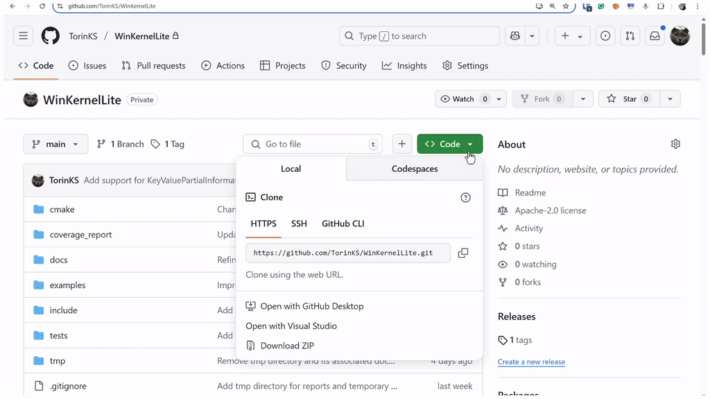

#  WinKernelLite

WinKernelLite is a lightweight Windows kernel API compatibility layer that simulates kernel functionality for testing and debugging driver-related code in user mode. It currently implements a limited subset of Windows kernel-mode APIs, allowing developers to write and test driver code in user mode instead of performing time-consuming, error-prone kernel-mode code writting and debugging.

## Motivation

The idea behind WinKernelLite arose from the recurring challenges of prototyping and debugging kernel-mode code in security solutions. In our projects, we often need to build systems with typical architectural logic that includes:
- Agents (Windows services) running on Windows machines, which receive rules and policies from the server and apply them to the kernel mode code using private IOCTL or minifilter driver communication ports. These agents manage permissions for various devices (e.g., USB, Bluetooth) and decide whether to allow or block access to specific devices or processes/threads.
- Drivers that persist policies and rules in the Windows registry to maintain policy enforcement even when user-mode code is unavailable. These drivers create in-memory structures such as AVL trees and linked lists to manage policies, enforce them by checking events from callbacks against the rules, and allow or disallow operations (e.g., creating processes/threads, reading from USB devices, opening files).

This work involves extensive use of:
- Kernel heap management functions (e.g., ExAllocatePool, ExFreePool).
- The UNICODE_STRING API (e.g., RtlCopyUnicodeString, RtlInitUnicodeString, RtlAppendUnicodeToString).
- Working with the Windows registry from kernel-mode code (e.g., ZwCreateKey, ZwOpenKey).
- Serialization and deserialization of rules passed between user-mode and kernel-mode components.
- Serialization and deserialization of events communicated back from kernel mode to user mode and so on.

WinKernelLite allows you to shift this functionality to user mode by separating it into a dependency (such as a static library), enabling prototyping, developing, debugging, and testing in user mode before building the final kernel-mode version.

**Key Benefits:**
- **Faster Development Cycle**: Test driver code without kernel-mode debugging overhead
- **Safe Testing Environment**: Debug memory allocation, registry operations, and UNICODE_STRING handling in user-mode
- **Code Prototyping**: Develop and refine kernel-mode logic with AI assistance or manual coding before kernel deployment
- **Modular Testing**: Extract and validate specific driver components independently

If you have driver code that handles memory allocation, registry operations, or UNICODE_STRING manipulation, you can isolate and test those components with this library. You can also prototype new code using the supported kernel-mode APIs, debug and refactor it thoroughly.

This library is a reincarnation of an previously writtern code, partially rewritten with the assistance of AI, as can be seen, for example, in some of the test cases.

## Short demo


## Features

- **Kernel Memory Allocation**: Implementation of `ExAllocatePool`, `ExFreePool`, and related functions as wrappers over user-mode `HeapAlloc` and `HeapFree` functions
- **Linked List Management**: Implementation of Windows kernel list manipulation routines for working with doubly linked lists and `LIST_ENTRY` structures in user-mode
- **Unicode String Handling**: Support for the `UNICODE_STRING` structure and associated functions
- **Memory Tracking**: Debug tools for tracking memory allocations and detecting leaks with detailed reporting
- **Generic Tables**: Support for generic tables (both Splay and AVL trees).
- **Registry Operations**: Support for kernel-mode registry APIs based on the Zw* family of functions.

## Requirements

- Windows operating system
- CMake
- Visual Studio 2019 or later with C/C++ development tools (other VS versions may also work, but they have not been tested)

## Building from Source

### Using CMake

```powershell
# Clone the repository
git clone https://github.com/TorinKS/WinKernelLite.git
cd WinKernelLite

# Create a build directory
mkdir build
cd build

# Configure the project
cmake ..

# Build the library
cmake --build . 

# Install (required for examples)
cmake --build . --target install

# Build examples (optional, separate step)
cmake --build . --target build_examples
```

**Two-Step Build Process**: 
1. **Main Library**: Built and installed first to `C:\Program Files\WinKernelLite\`
2. **Examples**: Built separately after installation using the installed headers

For convenience, you can also use the provided batch file for all build operations:

```powershell
# Full build with tests including examples and installation
.\_run_all.cmd

# Full build Debug version of library 
.\_run_all.cmd Debug

# Only build the library
.\_run_all.cmd --build-only

### Build Options

| Option             | Default | Description                                    |
|--------------------|---------|------------------------------------------------|
| BUILD_EXAMPLES     | OFF     | Build example projects                         |
| INSTALL_EXAMPLES   | OFF     | Install example binaries to Program Files     |
| ENABLE_COVERAGE    | ON      | Enable code coverage reporting                 |

Example:
```powershell
cmake -B build -DINSTALL_EXAMPLES=OFF -DENABLE_COVERAGE=ON
```

## Usage

### Include in Your Project

#### With CMake (Method 1: Find Package)

```cmake
find_package(WinKernelLite REQUIRED)
target_link_libraries(your_target PRIVATE WinKernelLite::WinKernelLite)
```
You can find this approach in the projects under the `./examples` directory. 

#### As a CMake Subdirectory (Method 2)

You can include WinKernelLite directly in your CMake project without installing it.

1. Add the WinKernelLite directory to your project or reference it as a Git submodule:

```powershell
git submodule add https://github.com/TorinKS/WinKernelLite.git external/WinKernelLite
git submodule update --init --recursive
```

2. Update your CMakeLists.txt:

```cmake
cmake_minimum_required(VERSION 3.29)
project(YourProject)

# Your executable/library
add_executable(YourExecutable src/main.cpp)

# Add WinKernelLite subdirectory
add_subdirectory(external/WinKernelLite)

# Link the library
target_link_libraries(YourExecutable PRIVATE WinKernelLite::WinKernelLite)
```

> **Note:** WinKernelLite defines an exported target called WinKernelLite::WinKernelLite which you can link to in your project.

## Documentation

Detailed documentation:

- [Installation Guide](docs/installation.md)
- [Contributing Guide](docs/contributing_guide.md)

## Examples

The library comes with an example demonstrating its use:

1. [**DevicesList**](examples/DevicesList) - Demonstrates linked lists with LIST_ENTRY and device management

### Running the Example

The example can be built and run independently from its directory. **Note**: The example requires WinKernelLite to be installed first.

```powershell
# First, install WinKernelLite
cmake --build build --target install

# Then run the example
cd examples\DevicesList
.\build_and_run.bat
```

## Testing

The library includes unit tests using the Google Test framework. To run the tests:

```powershell
# Build and run tests
cmake --build build --target runTests
# Execute tests
.\build\bin\runTests.exe --output-on-failure

# Generate test report to tmp directory
.\build\bin\runTests.exe --gtest_output=xml:tmp/test-results.xml
```

### Code Coverage

WinKernelLite uses OpenCppCoverage for tracking test coverage. To generate coverage reports:

```powershell
# Generate coverage report
cmake --build build --target coverage
```

The coverage report will be generated in HTML format in the `build/coverage` directory. Open `build/coverage/index.html` in a browser to view the detailed coverage analysis.

Reports and temporary files are stored in the `tmp/` directory, which is tracked by Git but ignores generated content.

> **Note:** OpenCppCoverage must be installed on your system. The build system will search for it in common installation paths or you can specify its location via the `OPENCPPCOVERAGE_PATH` environment variable.

## Contributing

Contributions are welcome! Please feel free to submit a Pull Request.

1. Fork the repository
2. Create your feature branch (`git checkout -b feature/amazing-feature`)
3. Commit your changes (`git commit -m 'Add some amazing feature'`)
4. Push to the branch (`git push origin feature/amazing-feature`)
5. Open a Pull Request

See the [Contributing Guide](docs/contributing_guide.md) for more details.

## License

This project is licensed under the Apache License 2.0 - see the [LICENSE](LICENSE) file for details.

## Contact

For bug reports or feature requests, please use the [GitHub Issues](https://github.com/TorinKS/WinKernelLite/issues) page.

